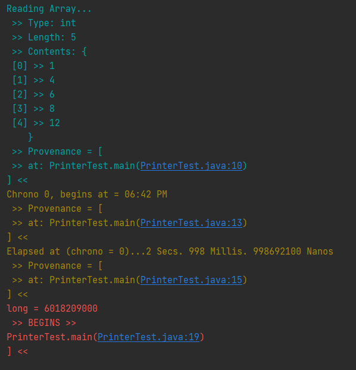

# Printer
A Java Print dependency for easy debugging.
Uses the default [System.out](https://docs.oracle.com/javase/8/docs/api/java/lang/System.html#out) [PrintStream](https://docs.oracle.com/javase/8/docs/api/java/io/PrintStream.html).
Methods like setAutoFlush(boolean) will alter the global state of `System.out`.

Sub-components:
 - [Chrono](https://html-preview.github.io/?url=https://github.com/Skylarkarms/Printer/blob/main/javadoc/Printer.Chrono.html)
 - [Export](https://html-preview.github.io/?url=https://github.com/Skylarkarms/Printer/blob/main/javadoc/Printer.Export.html)
 - [Editor](https://html-preview.github.io/?url=https://github.com/Skylarkarms/Printer/blob/main/javadoc/Printer.Editor.html)

### Example usage:

```java
public class PrinterTest {
    static int[] ints = new int[]{1, 4, 6, 8, 12};
    public static void main(String[] args) {
        Printer.printStack(true);
        Printer.cyan.print(ToStringFunction.inspect(ints));
        long nanos = Duration.ofSeconds(3).toNanos();
        Printer.Chrono chrono = new Printer.Chrono(Printer.Chrono.Format.full, Printer.yellow);
        chrono.start();
        LockSupport.parkNanos(nanos);
        chrono.elapsed();
        LockSupport.parkNanos(nanos);
        ToStringFunction.StackPrinter.params.prefix = "\n >> BEGINS >> \n";
        long elapse = chrono.elapsedNanos();
        Printer.red.print(elapse);
    }
}
```
Output: 
```text
Reading Array...
 >> Type: int
 >> Length: 5
 >> Contents: {
 [0] >> 1
 [1] >> 4
 [2] >> 6
 [3] >> 8
 [4] >> 12
    }
 >> Provenance = [
 >> at: PrinterTest.main(PrinterTest.java:10)
] <<
Chrono 0, begins at = 06:35 PM
 >> Provenance = [
 >> at: PrinterTest.main(PrinterTest.java:13)
] <<
Elapsed at (chrono = 0)...3 Secs. 2 Millis. 2910600 Nanos
 >> Provenance = [
 >> at: PrinterTest.main(PrinterTest.java:15)
] <<
long = 6010188100
 >> BEGINS >> 
PrinterTest.main(PrinterTest.java:19)
] <<
```


### Implementation
In your `build.gradle` file
```groovy
repositories {
   mavenCentral()
}

dependencies {
   implementation 'io.github.skylarkarms:printer:1.0.0'
}
```

or in your `POM.xml`
```xml
<dependencies>
   <dependency>
      <groupId>io.github.skylarkarms</groupId>
      <artifactId>printer</artifactId>
      <version>1.0.0</version>
   </dependency>
</dependencies>
```
